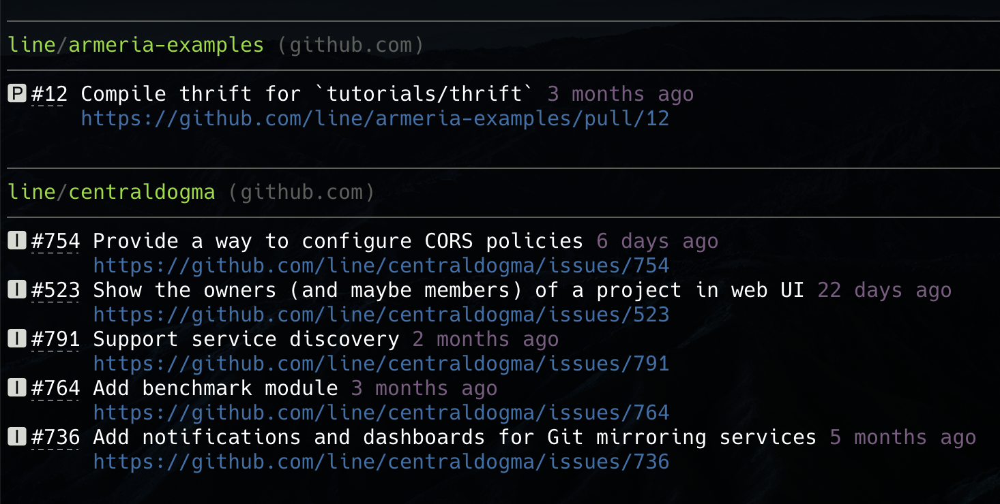

## gh-cmp

`gh-cmp` (GitHub, Check My Projects) lists the open and unread issues and pull requests from the GitHub and GitHub Enterprise repositories you're interested in.

Without this script, you'd have to check very noisy [GitHub notifications](https://github.com/notifications) or open a browser tab for each repository.



### Requirements

- [google/zx](https://github.com/google/zx)
  - MacOS: `brew install zx`
- [GitHub CLI](https://cli.github.com)
  - MacOS: `brew install gh`
  - `gh-cmp` is a frontend of GitHub CLI. Therefore, you need to make sure GitHub CLI is configured properly to send API requests. Acquire the access token beforehand by running `gh auth login`.

### Configuration

Put the list of the repositories you're interested in to `~/.config/gh-cmp/repositories.json5`, e.g.

```json5
[
  {
    // github.com/trustin/gh-cmp
    owner: 'trustin',
    name: 'gh-cmp',
  },
  // {
  //   // github-enterprise.acme.com/acme-engineering/acme-server
  //   host: 'github-enterprise.acme.com',
  //   owner: 'acme-engineering',
  //   repo: 'acme-server',
  // },
]
```

### Future works

- Use [Github notifications API](https://docs.github.com/en/rest/activity/notifications).
  - Get the complete list of unread items and remove uninteresting ones.
  - Get the unread discussions.
  - Summarize the failed actions.
- More customizability
- Single binary distribution
